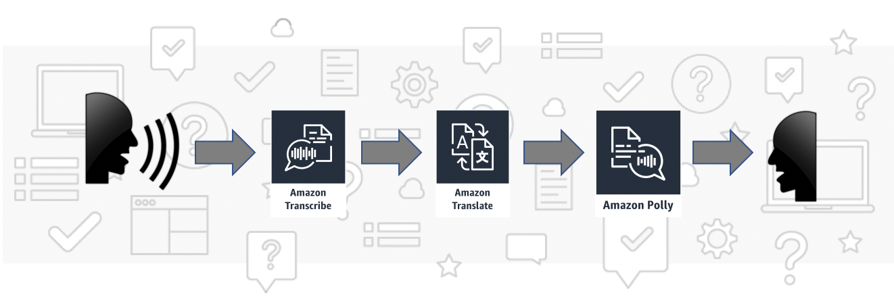

Protect your website and infrastructure using Amazon CloudFront
=========================================

This repository contains necessary resources for AWS re:Invent 2019 builder session NET302. In this readme you will find detailed instructions for each phase of the workshop.

Setup
-----

To build and protect your website with CloudFront you will need to accomplish 6 phases. Each of them will add new security functionality to your website.

