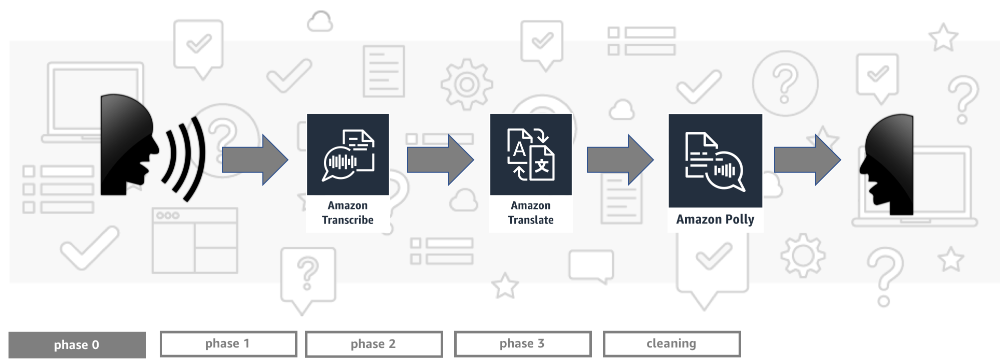

Protect your website and infrastructure using Amazon CloudFront
=========================================

This repository contains necessary resources for AWS re:Invent 2019 builder session NET302. In this readme you will find detailed instructions for each phase of the workshop.

Phase 0: Environment setup
-----

1. Sign into the AWS Console and choose `us-east-1` (N. Virginia) region.
2. Open Cloud9 service and create new environment. You can use default settings.
3. Download all needed resources using following command.

`aws s3 cp TODO`

4. Execute following command. It will create a new CloudFormation template - which will create a new S3 bucket, DynamoDB table and Cognito resources.

`cd ~/environment/reinvent`

`aws cloudformation create-stack --stack-name AppResources --region us-east-1 --capabilities CAPABILITY_IAM --template-body file://resources.yaml`

5. It will take about 1 minute for above resources to be created. Open CloudFormation service in AWS Console, where you will find information about your new stack. You will find 2 output parameters:
* `IdentityPoolIdOutput`
* `S3BucketName`

Note them - you will need them in next step.

**Once you're finished with this phase please wait for speakers to present the next one before moving forward.**

