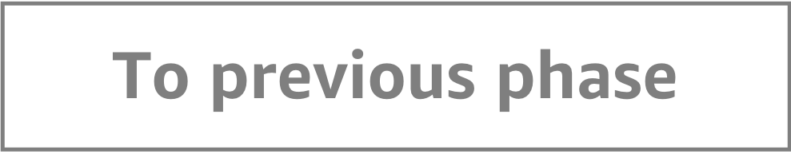

Protect your website and infrastructure using Amazon CloudFront
=========================================

This repository contains necessary resources for AWS re:Invent 2019 builder session NET302. In this readme you will find detailed instructions for each phase of the workshop.

Phase 0: Environment setup
-----

1. Sign into the AWS Console and choose `us-east-1` (N. Virginia) region.
2. Open Cloud9 service and create new environment. You can use default settings.
3. Download all needed resources using following command.

          `aws s3 cp TODO`

4. Execute following command. It will create a new CloudFormation template - which will create a new S3 bucket, DynamoDB table and Cognito resources.

          `cd ~/environment/reinvent`

          `aws cloudformation create-stack --stack-name AppResources --region us-east-1 --capabilities CAPABILITY_IAM --template-body file://resources.yaml`

5. It will take about 1 minute for above resources to be created. Open CloudFormation service in AWS Console, where you will find information about your new stack. You will find 2 output parameters:
* `IdentityPoolIdOutput`
* `S3BucketName`

Note them - you will need them in next step.

6. Open `myapp/script.js` file and provide `IdentityPoolIdOutput` value in line 7. Remember to save the file.
7. Open `myapp/index.php` file and provide  `S3BucketName` value in line 26. Remember to save the file.
8. Execute following command to retrieve your account id:

          `aws sts get-caller-identity`

9. Execute following commands (replace ACCOUNT_ID with you account id)

          `aws ecr create-repository --repository-name myrepo`

          `cd ~/environment/reinvent/myapp`

          `$(aws ecr get-login --no-include-email --region us-east-1)`

          `docker build -t myrepo .`

          `docker tag myrepo:latest ACCOUNT_ID.dkr.ecr.us-east-1.amazonaws.com/myrepo:latest`

          `docker push ACCOUNT_ID.dkr.ecr.us-east-1.amazonaws.com/myrepo:latest`

10. Execute following commands to create final application.

          `cd ~/environment/reinvent`

          `aws cloudformation create-stack --stack-name MyApplication --region us-east-1 --capabilities CAPABILITY_IAM --template-body file://myapp.yaml`

11. Execute following commands to copy three sample files to your bucket. Replace the bucket name with you bucket name.

          `aws s3 cp s3://tomash/workshops/vod-platform/01.mp4 s3://YOUR_BUCKET/01.mp4 --acl public-read`

          `aws s3 cp s3://tomash/workshops/vod-platform/02.mp4 s3://YOUR_BUCKET/02.mp4 --acl public-read`

          `aws s3 cp s3://tomash/workshops/vod-platform/03.mp4 s3://YOUR_BUCKET/03.mp4 --acl public-read`

12. It will take about 3-4 minutes for the applicatiion to be created. After this time, you will find a new stack in CloudFormation service with new output value - pointing to you website. Open it and see if it's working.

**Once you're finished with this phase please wait for speakers to present the next one before moving forward.**

